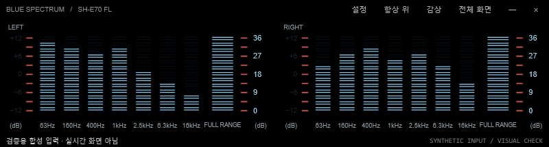

# Blue Spectrum v1.7 · SH-E70 FL

Windows 11에서 PC 재생 소리에 반응하는 좌·우 청색 스펙트럼 애널라이저입니다. Technics SH-E70의 두 표시창에서 영감을 받은 개인용 프로그램입니다.

*합성 오디오로 만든 화면 예시입니다. 프로그램은 실행 중 PC 재생 소리를 실시간으로 분석합니다.*

## 다운로드

[Windows x64 버전 다운로드](https://github.com/maniac428/BlueSpectrum/releases/latest/download/BlueSpectrum-SH-E70-v1.7-Windows-x64.zip) 후 압축을 풀고 `BlueSpectrum.exe`를 실행하세요. 별도 .NET 설치는 필요하지 않습니다. SHA-256은 [릴리스 페이지](https://github.com/maniac428/BlueSpectrum/releases/latest)에서 확인할 수 있습니다.

## 주요 기능

- 좌·우 독립 분석, 7개 주파수 대역과 전체 범위 표시
- PC 재생 소리만 읽으며, 녹음·마이크·클라우드 전송은 하지 않음
- 감상 모드로 시작하며 창 위치와 설정을 저장
- GPU 선택과 목표 30/60 FPS 설정
- 올블랙 화면과 SH-E70을 참고한 두 청색 표시창

## 조작

- **Esc**: 메뉴와 상태 영역 표시
- **우클릭**: 설정 및 종료 메뉴
- **Ctrl+M**: 감상 모드 전환 · **F11**: 전체 화면
- 표시창을 끌어 창을 옮기고 가장자리를 끌어 크기를 조절합니다.

앱은 실제 이퀄라이저가 아닙니다. 왼쪽 ±12 눈금은 장식이며 소리를 보정하지 않습니다. 오른쪽 0–36 눈금도 원기기와 교정된 계측값이 아닙니다. 모노는 양쪽에 같은 신호를 표시하고 다채널은 전면 좌·우를 표시합니다.

소스 빌드 안내는 `build.ps1`에 있습니다. 제3자 구성 요소의 고지는 `THIRD-PARTY-NOTICES.md`와 `licenses/`에 있습니다. 앱 자체의 사용 허가 라이선스는 아직 지정하지 않았습니다.
